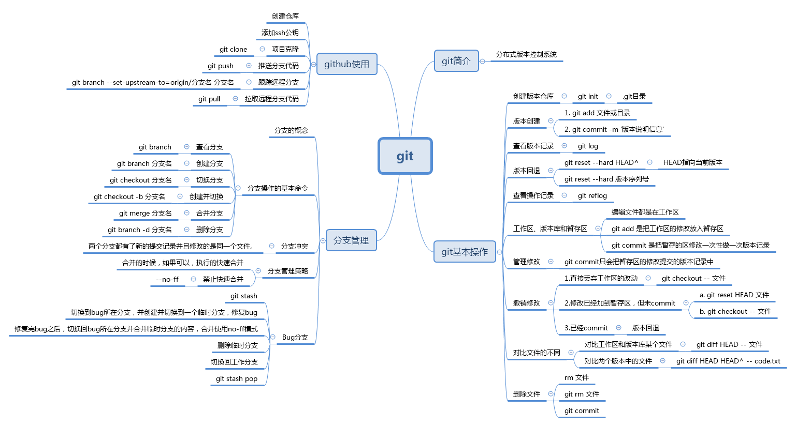

# Git使用简记

---

---
---

## 简单使用

---

### 初始化仓库

1. `git init` 在当前目录下初始化git仓库
   1. 当前目录称为**工作区**(Working Directory)
   2. 完成后当前目录下新增的`.git`目录称为**版本库**(本地仓库,Repository)
      1. 最主要的是**暂存区**(stage/index)
      2. 自动创建第一个分支master(**主分支**)
      3. 指向master的一个**指针**HEAD

---

### 创建版本记录

1. `git add <文件>` 暂存工作区中的*文件*,**实际存到暂存区**,在提交之前可执行多次暂存操作
   1. `git add .` 暂存整个工作区
   2. 未暂存的文件属于**未跟踪的文件**,Git不会记录任何相关信息
2. `git commit -m "<说明信息>"` 提交**暂存区的全部内容到当前分支**,生成一个版本记录(唯一的版本号,带有*说明信息*)
   1. 仅仅提交暂存区中的内容
   2. HEAD指针指向最新版本

---

### 查看版本信息

1. `git log` 版本记录
   1. `git log --pretty=oneline` 以单行精简形式显示

---

### 版本控制

1. `git reset --hard HEAD^` **回退相对版本**
   1. `HEAD` 表示最新版本
   2. `HEAD^` 表示上一个版本
   3. `HEAD^^` 表示上上一个版本
   4. `HEAD~100` 表示相对前100个版本
2. `git reset --hard <版本编号>` **到特定版本**
   1. 不必使用完整的*版本编号*,使用编号前几个即可

---

### 查看操作记录

1. `git reflog` 操作记录
   1. 可以看到版本编号的前一部分

---

### 查看工作树的状态

1. `git status` 工作树状态(修改/跟踪/提交/删除...)
   1. 某次提交之后,新的更改之前,工作区处于**干净的状态**

---

### 丢弃工作区的改动

1. 修改了工作区某个文件的内容,希望直接丢弃工作区的修改时,用命令`git checkout -- <文件>` 丢弃工作区中*文件*的改动
2. 不仅修改了工作区中某个文件的内容,还将其添加到了暂存区中,希望丢弃修改时,分两步,第一步用命令`git reset HEAD <文件>` 以**取消暂存的变更**,于是回到了场景1,第二步按场景1操作.
3. 已经将修改提交到版本库,参考**版本控制(回退)**

---

### 对比文件的不同

1. 对比工作区和某个版本中文件的不同
   1. `git diff HEAD -- <文件>` 对比工作区中*文件*和HEAD版本中*文件*的不同
      1. '-'代表diff后第一个参数,即HEAD版本
      2. '+'代表diff后第二个参数,即工作区版本
2. 对比两个版本间文件的不同
   1. `git diff HEAD HEAD^ -- <文件>` 对比HEAD和HEAD^版本中*文件*的不同
      1. '-'代表diff后第一个参数,即HEAD版本
      2. '+'代表diff后第二个参数,即HEAD^版本

---

### 删除文件

1. 误删除文件,希望撤销时.参考**丢弃工作区的改动**
2. 确实要删除文件,则暂存后提交即可.
   1. `git rm <文件>` 或 `git add <文件>` 暂存
      1. 命令`git rm`用于删除一个文件.如果一个文件已经被提交到版本库,那么你永远不用担心误删,但是要小心,你只能恢复文件到最新版本,意味着会丢失最近一次提交后你修改的内容.
   2. 提交

---

## 分支管理

---

### 创建与合并分支

1. 分支: git把每次提交的版本串成一条时间线,这条时间线就是一个分支.
2. HEAD严格来说不是指向提交,而是指向master. master才是指向提交的,所以HEAD指向的就是当前分支.
3. 当我们创建新的分支(例如dev时),git新建一个指针(叫dev),指向与master相同的提交,再把HEAD指向dev,就表示当前分支在dev上.
4. 假如我们在dev上的工作已完成,就可以把dev合并到master上.最简单的方法是直接把master指向dev的当前提交,完成合并.
5. 合并完分支后,可以删除dev分支(将dev指针删掉),只剩下一条master分支.
6. `git branch` 查看分支信息
7. `git branch dev` 创建分支*dev*
8. `git checkout -b dev` 创建并切换到分支*dev*
   1. 与创建分支然后切换分支的效果相同
9. `git checkout master` 切换到分支*master*
10. `git merge dev` 合并指定分支(*dev*)到当前分支
    1. `Fast-forward` 快速合并模式
11. `git branch -d dev` 删除本地分支*dev*
12. `git push origin --delete dev` 删除远程dev分支

---

### 解决冲突

1. 两个分支对相同的文件分别有新的提交时,合并可能产生冲突.可以使用`git status`查看是否与冲突.
2. 需要手动处理冲突,之后执行一次新的提交以解决冲突.
3. 解决后可以使用`git log --graph --pretty=oneline` 查看分支的合并情况.

---

### 分支管理策略

1. 通常,合并分支时git会用*fast forward*模式,但是有些快速合并不能成功而且合并时没有冲突,这个时候会合并(弹出特殊窗口)之后并做一次新的提交.
2. 如果要强制禁用*fast forward*模式,git就会在merge时生成一个新的commit,这样就可以**从分支历史上看出分支信息**.
3. `git merge --no-ff -m "<说明信息>" dev` 禁用*fast forward*模式.

---

### bug分支

1. 每个bug都可以通过一个新的临时分支来修复,修复后合并分支,然后将临时分支删除.
2. 如果当前工作未完成,使用`git stash` 把当前现场保存起来.
3. 修复完成后,bug分支合并到主分支时,**为了保留bug分支记录**,需要禁用*fast forward*模式.
4. `git stash list` 工作现场保存信息.
5. `git stash pop` 恢复保存的工作现场.

---

## Github

---

### 新建仓库

1. 点击`New respository`
   1. `README.md` 简介 = 5w + 1h.
   2. `.gitignore` 不需要跟踪的文件类型.
   3. `license` 授权协议.

---

### 添加SSH账户

1. 如果某台机器需要与github上的仓库交互,那么就要把这台机器的ssh公钥添加到这个github账户上.
2. 配置`.gitconfig` 用户名和邮箱.
3. `ssh-keygen -t rsa -C "邮箱地址"` 生成SSH密钥,位于用户目录下的`.ssh`.
4. 将公钥添加到Github账户.

---

### 克隆项目

1. `git clone <url>`
   1. 可选`HTTP`或`SSH`

---

### 上传分支

1. `git push origin <本地分支名称>`
2. `git push -u origin master` 在远程仓库新建分支(`-u`)master,并将本地分支推送到到远程仓库

---

### 本地分支跟踪远程分支

1. `git branch --set-upstream-to=origin/<远程分支名称> <本地分支名称>`
2. `git remote add origin git@github.com:<用户名>/<仓库名>.git` 本地关联远程仓库

---

### 从远程分支上拉取代码

1. `git pull orgin <分支名称>`

---
